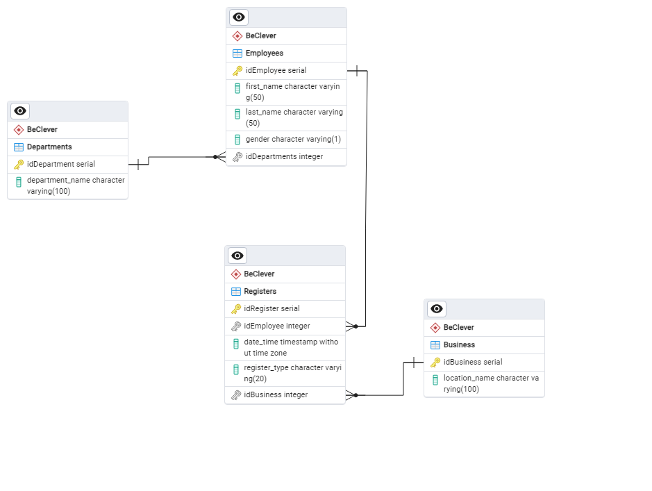
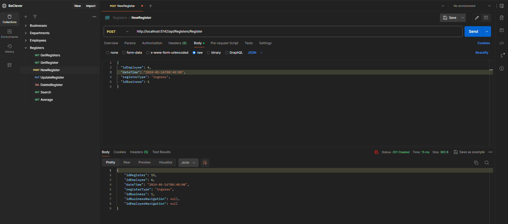
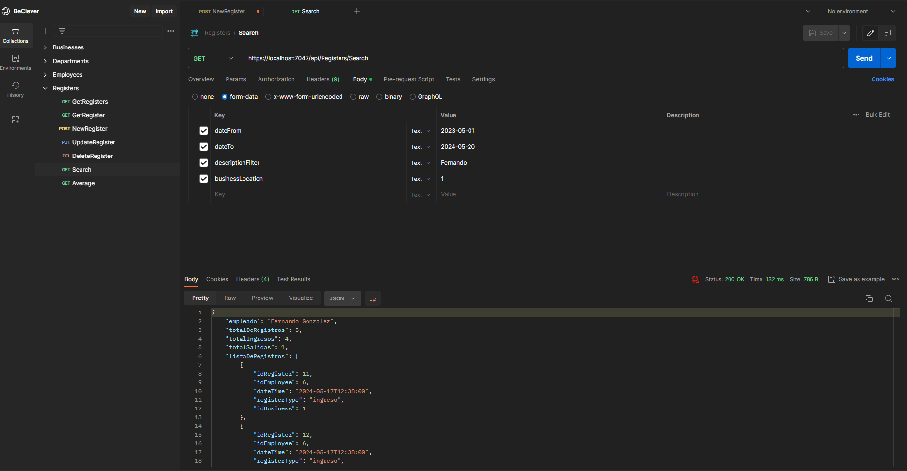
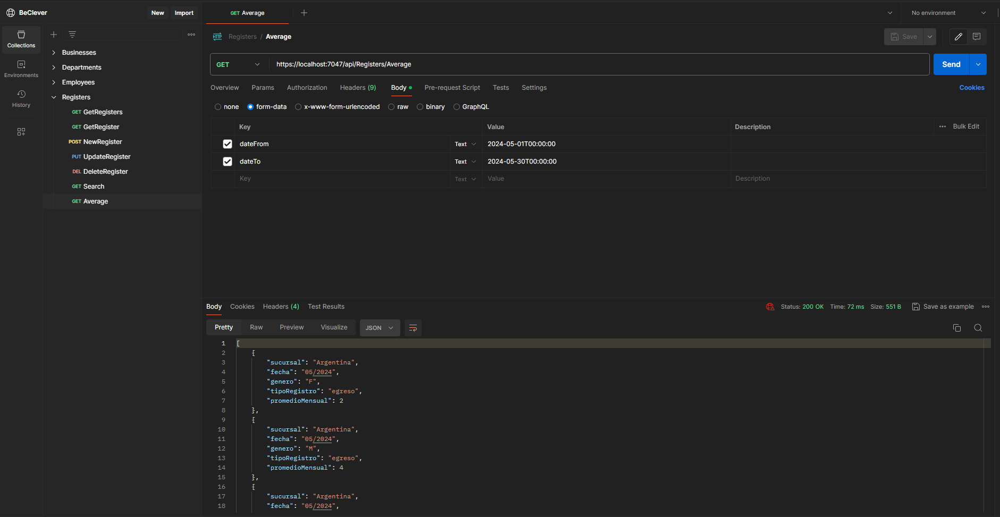

# Desafío Técnico - BeClever

La empresa Clever Business cuenta con 3 sucursales distribuidas en diferentes países: Argentina, Brasil y España. En el último tiempo está teniendo problemas para el control del personal que ingresa y egresa día a día en sus instalaciones, por lo que decide contratar un sistema el cual le permita tener un control total del ingreso/egresos. Para esto la empresa decide contratar tus servicios. Como encargado del desarrollo tu misión es crear una capa de servicios (API REST) que puedan ser consumidos por las diferentes plataformas que cuenta Clever Business (Mobile-Web). 

## Objetivo
Crear una API REST utilizando .NET Core que permita gestionar el control de ingreso/egreso del personal de Clever Business y proporcionar funcionalidades para obtener informes sobre los registros de ingresos y egresos.

## Descripción del Servicio
### Servicio 1
Función: `register(idEmployee, date, registerType, businessLocation)`  
Descripción: Guarda en la base de datos los ingresos y egresos del personal.

### Servicio 2
Función: `search(dateFrom, dateTo , descriptionFilter, businessLocation)`  
Descripción: Lista la cantidad de ingresos y egresos en un rango de fechas dado, con la posibilidad de filtrar por nombre o apellido y sucursal.

### Servicio 3
Función: `average (dateFrom, dateTo )`  
Descripción: Devuelve el promedio de hombres y mujeres que ingresan y egresan por mes, por cada sucursal.

## Base de Datos
Se utilizo PostgreSQL como base de datos. El proyecto se realizó utilizando el enfoque **Database First**, donde primero se diseñó la base de datos en **pgAdmin4**, y luego se realizó ingeniería inversa para obtener los modelos necesarios del proyecto.



- Se proporciona el archivo de diseño de las tablas en el formato de **pgadmin4** ubicado en `Documentacion/BeCleverDB.pgerd` 
- Se proporciona un script para crear la base de datos completa en el archivo `Documentacion/ScriptDB_Complete.sql` 
- Un script para crear solo la estructura de tablas correspondientes en el archivo `Documentacion/Script_DB_Only_Tables.sql`
- Y por ultimo un script para cargar los datos necesarios apra realizar pruebas en el archivo `Documentacion/DatosBackup.sql`

## Tecnologías Utilizadas
- **.NET Core API**
- **Entity Framework**
- Base de datos: **PostgreSQL**
- Herramienta de Pruebas: **Postman**

## Configuración del Entorno de Desarrollo

**Pasos para configurar el entorno de desarrollo:**

1. **Instalación de .NET Core:** <a href="https://dotnet.microsoft.com/download" target="_blank">Instrucciones para instalar .NET Core</a>.
2. **Clonar el Repositorio:** Clona este repositorio en tu máquina local.
3. **Configuración de la Base de Datos:** <a href="https://www.postgresql.org/download/" target="_blank">Descargar e instalar PotgreSQL</a>. Luesgo desde la herramienta PgAdmin4 cargar el script de la base de datos completo `Script_DB_Only_Tables.sql` y ejecutarlo. Luego cargar los datos para pruebas desde el script `DatosBackup.sql` o insertar datos manualmente por emdio de cada metodo disponible en la **API**.   
**Al finalizar la configuracion de la base de datos deberia quedar algo como lo siguiente en la estructura de PgAdmin4**

    

4. **Configurar cadena de conexion**: Busca el archivo de configuración de la aplicación, llamado `appsettings.json` el cual se encuentra en la raiz del proyecto y luego modificar los parametros de conexion segun sean necesario (nombre de la base de datos, contraseña, etc).

    ```json
    "ConnectionStrings": {
      "BeClever": "Host=localhost;Port=5432;Database=BeClever;Username=postgres;Password=*******;"
    }
    ```

5. **Inicializar el proyecto**: agregando la carpeta del proyecto en **Visual Studio** y ejecutando el proyecto o si es desde **Visual Studio Code** se debera configurar el puerto por el que quiere iniciar en local y luego correr el proyecto mediante comandos `dotnet build` y `dotnet run`


## Esquema de metodos

## Businesses

| Método | URL                                           | Descripción                                    |
|--------|-----------------------------------------------|------------------------------------------------|
| GET    | `/api/Businesses`                            | Obtiene la lista de todos los Businesses.    |
| GET    | `/api/Businesses/{id}`                       | Obtiene los detalles de un Business específico. |
| PUT    | `/api/Businesses/update/{id}`                | Actualiza la información de un Business existente. |
| POST   | `/api/Businesses/new`                        | Crea un nuevo Business.                      |
| DELETE | `/api/Businesses/delete/{id}`                | Elimina un Business existente.               |

## Departments

| Método | URL                                           | Descripción                                    |
|--------|-----------------------------------------------|------------------------------------------------|
| GET    | `/api/Departments`                           | Obtiene la lista de todos los Departments.   |
| GET    | `/api/Departments/{id}`                      | Obtiene los detalles de un Department específico. |
| PUT    | `/api/Departments/update/{id}`               | Actualiza la información de un Department existente. |
| POST   | `/api/Departments/new`                       | Crea un nuevo Department.                     |
| DELETE | `/api/Departments/delete/{id}`               | Elimina un Department existente.              |

## Employees

| Método | URL                                           | Descripción                                    |
|--------|-----------------------------------------------|------------------------------------------------|
| GET    | `/api/Employees`                             | Obtiene la lista de todos los Employees.     |
| GET    | `/api/Employees/{id}`                        | Obtiene los detalles de un Employee específico. |
| PUT    | `/api/Employees/update/{id}`                 | Actualiza la información de un Employee existente. |
| POST   | `/api/Employees/new`                         | Crea un nuevo Employee.                       |
| DELETE | `/api/Employees/delete/{id}`                 | Elimina un Employee existente.                |

## Registers

| Método | URL                                           | Descripción                                    |
|--------|-----------------------------------------------|------------------------------------------------|
| POST   | `/api/Registers/Register`                    | Registra un nuevo ingreso o egreso.          |
| GET    | `/api/Registers/Search`                      | Busca registros dentro de un rango de fechas y con distintos filtros.|
| GET    | `/api/Registers/Average`                     | Obtiene el promedio de hombres y mujeres que ingresan y egresan por mes.|
| GET    | `/api/Registers`                             | Obtiene la lista de todos los Registers.     |
| GET    | `/api/Registers/{id}`                        | Obtiene los detalles de un Register específico. |
| PUT    | `/api/Registers/update/{id}`                 | Actualiza la información de un Register existente. |
| DELETE | `/api/Registers/delete/{id}`                 | Elimina un Register existente.               |


## Pruebas Realizadas
Las pruebas realizadas en este proyecto incluyen:
- **Pruebas de API con Postman:** Pruebas realizadas utilizando Postman para verificar el comportamiento de la API REST.

## Ejecución de Pruebas con Postman
Para ejecutar las pruebas desde la API con Postman:

1. **Importar la Colección de Postman:** Importa las colecciones de pruebas de Postman ubicadas en `/Postman/postman_collection.json` de las cuales hay un archivo por cada controlador.
2. **Configurar Variables de Entorno:** Configura las variables de entorno en Postman según sea necesario.
3. **Ejecutar las Pruebas:** Ejecuta las pruebas desde Postman y verifica los resultados.


## Probar los servicios solicitados

### Servicio 1

- Para realizar la prueba del Servicio 1 desde Postman utilizando el la url corrspondiente `/api/Registers/Register` y los siguientes datos

    ```json
    {
      "idEmployee": 6, // el id del empleado debe esta registrado en la base de datos
      "dateTime": "2024-05-16T00:40:00", //la fecha debe ser mayor o igual a la actual
      "registerType": "ingreso", // los tipos son ingreso y egreso
      "idBusiness": 1 // el id de la empresa es 1 que corresponderia a Argentina
    }
    ```
    
    Imagen ilustrativa del proceso:

    

### Servicio 2

- Para realizar la prueba del Servicio 2 desde Postman utilizando el la url corrspondiente `/api/Registers/Search` y los siguientes datos

    Para el formulario los parametros son: `dateFrom`, `dateTo`, `descriptionFilter`, `businessLocation`, la devolucion de metodo es el nombre completo del empleado, el total de registros y el total de entradas y salidas, luego adicional a eso regresa un listado de todos los registros encontrados.
    
    Imagen ilustrativa del proceso:

    


### Servicio 3

- Para realizar la prueba del Servicio 3 desde Postman utilizando el la url corrspondiente `/api/Registers/Average` y los siguientes datos

    Para el formulario los parametros son: `dateFrom`, `dateTo`, la devolucion del metodo es el promedio de entradas y salidas de hombres y mujeres por cada mes que cubre en la fecha desde y hasta.

    Imagen ilustrativa del proceso:

    
    
    
 
 
 <a href="https://www.linkedin.com/in/danielsan94" target="_blank">@DanielSan</a>